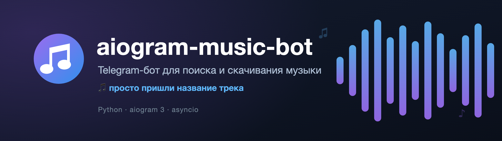
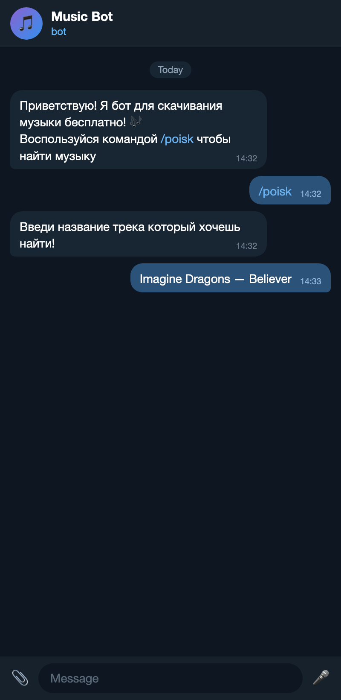
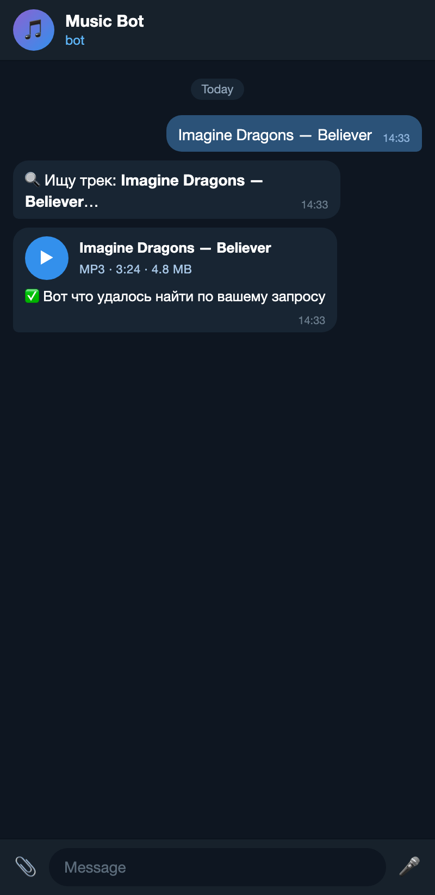

<p align="center">
  
</p>

<p align="center">
  <b>Telegram-бот для поиска и скачивания музыки — просто пришли название трека.</b><br>
  <b>A Telegram bot that finds &amp; downloads music — just send a track name.</b>
</p>

<p align="center">
  
  
  
</p>

<p align="center">
  🌐 <a href="#русский">Русский</a> · <a href="#english">English</a>
</p>

<p align="center">
  
  &nbsp;&nbsp;
  
</p>
<p align="center"><sub>Поиск трека и результат — бот присылает найденное как аудио · Search flow &amp; the track delivered as audio</sub></p>

---

## Русский

### Что это
Асинхронный Telegram-бот на **aiogram 3**: пишешь название песни — бот находит её, скачивает
`.mp3` и присылает готовым аудиофайлом прямо в чат. Никаких сайтов и рекламы — весь поиск
и загрузка происходят на стороне бота.

### ✨ Возможности
- 🔎 **Поиск по названию** — просто отправь название трека.
- 🎧 **Отправка аудио** — трек приходит как проигрываемое аудио в Telegram.
- 🛟 **Умные фолбэки** — если не удалось отправить аудио, бот пришлёт файл документом, а если и это
  не вышло — inline-кнопку с прямой ссылкой на скачивание.
- ⚙️ **FSM** — диалог поиска на конечном автомате aiogram (состояние ожидания названия).
- 🧹 **Без мусора** — временный `.mp3` удаляется сразу после отправки.

### 🛠 Как работает
```
Пользователь ──/poisk──▶ вводит название ──▶  бот
                                              ├─ ищет на eu.hitmoz.com (парсинг HTML / data-* / JS)
                                              ├─ скачивает .mp3 во временную папку
                                              └─ отправляет аудио  (фолбэк: документ → кнопка-ссылка)
```

### 🧱 Стек
`Python 3.12` · `aiogram 3` (FSM, polling) · `requests` + `beautifulsoup4` (парсинг) ·
`python-dotenv`

### 🚀 Установка
```bash
git clone https://github.com/suffer1aSEO/aiogram-music-bot.git
cd aiogram-music-bot

python -m venv venv
source venv/bin/activate        # Windows: venv\Scripts\activate

pip install -r requirements.txt
```

### 🔑 Настройка
Получи токен у [@BotFather](https://t.me/BotFather) и создай файл `.env` (пример — `.env.example`):
```env
BOT_TOKEN=123456789:AAExxxxxxxxxxxxxxxxxxxxxxxxxxxxxxxxx
```

### ▶️ Запуск
```bash
python main.py
```
Открой бота в Telegram и нажми **/start**.

### 💬 Команды
| Команда  | Что делает |
|----------|------------|
| `/start` | Приветствие и краткая справка |
| `/poisk` | Начать поиск — далее просто пришли название трека |

### ⚠️ Важно про сервер (ошибка 403)
Сайт-источник блокирует запросы с IP дата-центров, поэтому **лучше запускать бота с домашнего
ПК**. Если разворачиваешь на VPS и ловишь `403` — используй **прокси** с «жилым» (residential) IP.

### 📄 Дисклеймер
Проект сделан в учебных целях. Скачивай только ту музыку, на которую у тебя есть права, и уважай
условия использования сайта-источника и авторские права.

---

## English

### What it is
An async Telegram bot built with **aiogram 3**: send a song title and the bot finds it, downloads
the `.mp3` and sends it back as a playable audio file — no websites, no ads, all done bot-side.

### ✨ Features
- 🔎 **Search by name** — just send a track title.
- 🎧 **Audio delivery** — the track arrives as playable Telegram audio.
- 🛟 **Smart fallbacks** — if audio fails it sends the file as a document; if that fails too, an
  inline button with a direct download link.
- ⚙️ **FSM** — the search dialog uses aiogram's finite-state machine.
- 🧹 **No leftovers** — the temp `.mp3` is deleted right after sending.

### 🛠 How it works
```
User ──/poisk──▶ sends a title ──▶  bot
                                    ├─ searches eu.hitmoz.com (HTML / data-* / JS parsing)
                                    ├─ downloads the .mp3 to a temp dir
                                    └─ sends audio  (fallback: document → link button)
```

### 🧱 Tech stack
`Python 3.12` · `aiogram 3` (FSM, polling) · `requests` + `beautifulsoup4` (scraping) ·
`python-dotenv`

### 🚀 Install
```bash
git clone https://github.com/suffer1aSEO/aiogram-music-bot.git
cd aiogram-music-bot

python -m venv venv
source venv/bin/activate        # Windows: venv\Scripts\activate

pip install -r requirements.txt
```

### 🔑 Configure
Get a token from [@BotFather](https://t.me/BotFather) and create a `.env` (see `.env.example`):
```env
BOT_TOKEN=123456789:AAExxxxxxxxxxxxxxxxxxxxxxxxxxxxxxxxx
```

### ▶️ Run
```bash
python main.py
```
Open the bot in Telegram and hit **/start**.

### 💬 Commands
| Command  | What it does |
|----------|--------------|
| `/start` | Greeting and a short hint |
| `/poisk` | Start a search — then just send the track title |

### ⚠️ Server note (HTTP 403)
The source site blocks datacenter IPs, so **running from a home PC works best**. On a VPS you may
hit `403` — use a **residential proxy** to get around it.

### 📄 Disclaimer
Built for educational purposes. Only download music you have the rights to, and respect the source
site's terms of service and copyright.
